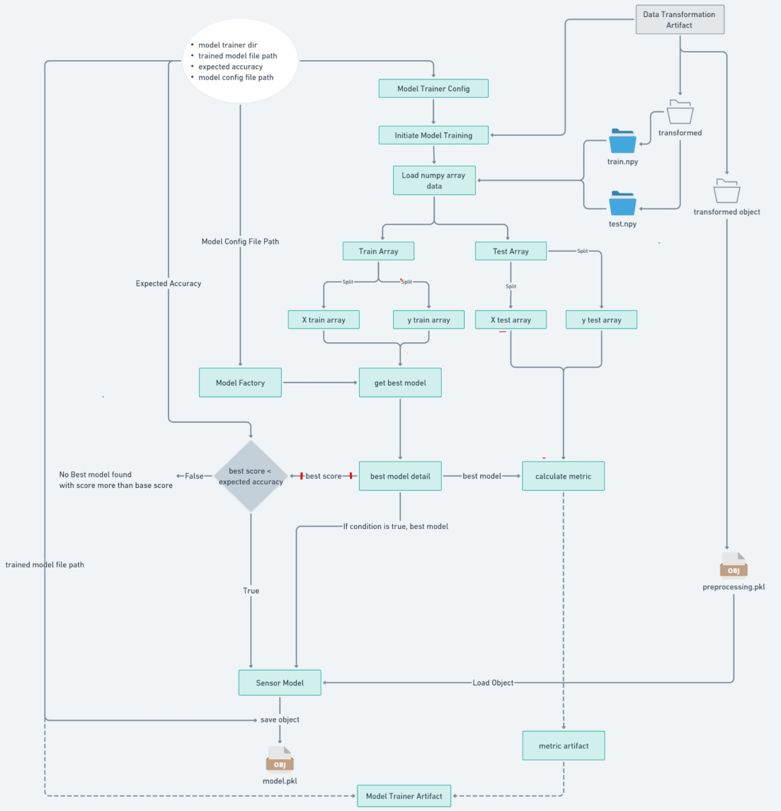

### MLOps Project: Phishing Data Detection with Network Security

#### Project Structure

#### Data Ingestion

#### Data Validation

#### Data Transformation

#### Train Model

---

### Steps to Set Up and Connect to a Free MongoDB Cluster

1. **Create a Free Cluster**:
    - Log in to your MongoDB Atlas account and click on the option to create a free cluster.

2. **Choose Cluster Configuration and Deploy**:
    - Follow the steps to configure your cluster (e.g., cloud provider, region, etc.).
    - Click Create to begin the deployment process.

3. **Connect to the Cluster**:
    - Once the deployment is complete, click on Connect.
    - Select the option *Connect with MongoDB Driver* and click Next.
    - Copy the connection string or the full code sample provided.

4. **Set Up User Credentials**:
    - Navigate to the *Security* section in the MongoDB Atlas dashboard.
    - Click on *Quick Start* and create a user by specifying a username and password for the connection.

5. **Use the Connection String**:
    - Replace the `<username>` and `<password>` placeholders in the connection string with the credentials you created.
    - Update the `<your-cluster-url>` with the specific cluster URL provided in the connection string.

6. **Configure Network Access**:
    - **Access Network Settings**:
        - Go to the *Network Access* section in your MongoDB Atlas dashboard.
    - **Add IP Access**:
        - Click on *Add IP Address*.
    - **Allow Access from Anywhere**:
        - In the IP access list entry, select the option to *Allow access from anywhere*, or manually enter the IP address range `0.0.0.0/0`.
    - **Confirm the Changes**:
        - Click *Confirm* to save your settings.

### Steps Connect to DagsHub for model Evaluation

### Connect to DagsHub for model Evaluation

Here are the steps to connect your project from your Git repository to DagsHub:

Step 1: Log in to DagsHub

Go to https://dagshub.com and log in to your account. If you don't have an account, create one by clicking on "Sign up".

Step 2: Create a new repository on DagsHub

Click on the "New Repository" button and select the option to connect to a Git repository. This will create a new repository on DagsHub that is linked to your existing Git repository.

Step 3: Link your Git repository to DagsHub

Follow the prompts to link your Git repository to DagsHub. This will allow you to synchronize your code changes between the two platforms.

Step 4: Configure DagsHub settings

On the page of your DagsHub repository, click on the "Remote" tab at the top of the page. Then, click on "Experiments" and copy the MLflow tracking remote URL.

Next, click on "Data" and select DVC. You can copy your access token from this page.

Step 5: connection to mlflow

To connect to MLflow, you will need to fill in the following information :

>import dagshub
>dagshub.init(repo_owner='username', repo_name='repo_name', mlflow=True)

Step 6: Model Evaluation
After running your code, follow these steps to evaluate your model:

Evaluate Model Performance

1. Go to your project on DagsHub.
2. Click on the "Experiments" tab.
3. You will see information related to model evaluation, including metrics and performance metrics.
4. To see more detailed information, click on the "Go to MLflow UI" button.
5. This will take you to the MLflow UI, where you can view more detailed information about your model's performance, including:

    - Model metrics (e.g. accuracy, precision, recall)
    - Model parameters
    - Model artifacts (e.g. model weights, biases)
    - Experiment history (e.g. previous runs, hyperparameter tuning)

By following these steps, you can evaluate the performance of your model and gain insights into how to improve it.

### Steps: Use FastAPI to Train

After running the command:

> uvicorn app:app --reload

You will get the following output:
Uvicorn running on http://127.0.0.1:8000
This will display the FastAPI Swagger API. Use the following URL to access it:

> http://127.0.0.1:8000/docs

This will display the API documentation, including authentication and default .

To run the training model:

1. Choose the default.
2. Click on the "Try it out" button.
3. Click on the "Execute" button to run the training pipeline.

### Step: Use FastAPI to Predict

Start the FastAPI server by running the following command:

> uvicorn app:app --reload

Access the Swagger API documentation at:

> http://127.0.0.1:8000/docs

In the default section, you will find options for both training and prediction.

To run the prediction pipeline:

1. Select the predict endpoint.
2. Click on the Try it out button.
3. Choose a file from the project folder:
    - Navigate to the valid_data folder.
    - Select the test.csv file.
4. Click on the Execute button.
After execution, you will be able to see the prediction results.