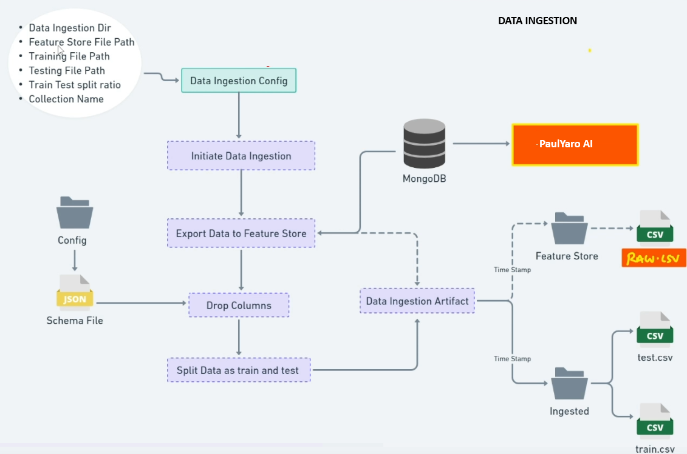
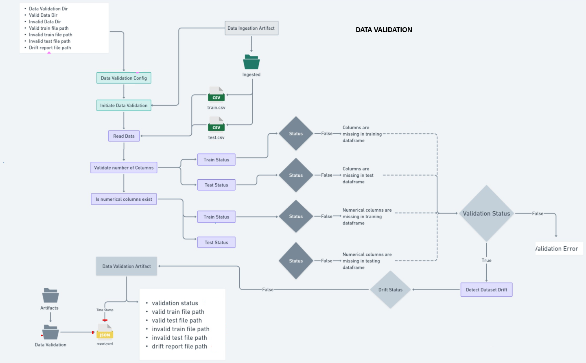
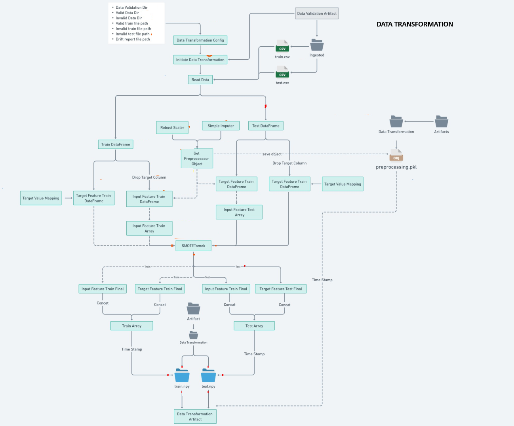

### MLOps Project: Phishing Data Detection with Network Security

#### Project Structure

#### Data Ingestion

#### Data Validation

#### Data Transformation

---

### Steps to Set Up and Connect to a Free MongoDB Cluster

1. **Create a Free Cluster**:
    - Log in to your MongoDB Atlas account and click on the option to create a free cluster.

2. **Choose Cluster Configuration and Deploy**:
    - Follow the steps to configure your cluster (e.g., cloud provider, region, etc.).
    - Click Create to begin the deployment process.

3. **Connect to the Cluster**:
    - Once the deployment is complete, click on Connect.
    - Select the option *Connect with MongoDB Driver* and click Next.
    - Copy the connection string or the full code sample provided.

4. **Set Up User Credentials**:
    - Navigate to the *Security* section in the MongoDB Atlas dashboard.
    - Click on *Quick Start* and create a user by specifying a username and password for the connection.

5. **Use the Connection String**:
    - Replace the `<username>` and `<password>` placeholders in the connection string with the credentials you created.
    - Update the `<your-cluster-url>` with the specific cluster URL provided in the connection string.

6. **Configure Network Access**:
    - **Access Network Settings**:
        - Go to the *Network Access* section in your MongoDB Atlas dashboard.
    - **Add IP Access**:
        - Click on *Add IP Address*.
    - **Allow Access from Anywhere**:
        - In the IP access list entry, select the option to *Allow access from anywhere*, or manually enter the IP address range `0.0.0.0/0`.
    - **Confirm the Changes**:
        - Click *Confirm* to save your settings.
